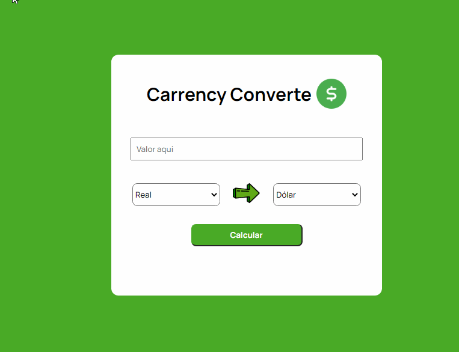

# Carrency Converte

 

This project was developed with pure JavaScript, and obtaining the current currency values was done through the 
[ExchangeRate-API](https://www.exchangerate-api.com/)

 

### Demonstration

<h1 align="center">
  
</h1>

 

## My process

### Built with

- HTML5
- CSS
- JavaScript
- Api JavaScript

 

## Author

- Linkedin - [Ian Hadrien](https://www.linkedin.com/in/ian-hadrien-8051181b1/)

 

### Icon Credits

[Dólar ícones criados por kliwir art - Flaticon](https://www.flaticon.com/br/icones-gratis/dolar)

[Seta ícones criados por Smashicons - Flaticon](https://www.flaticon.com/br/icones-gratis/seta)